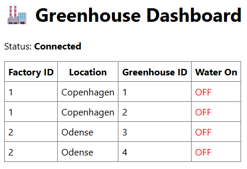
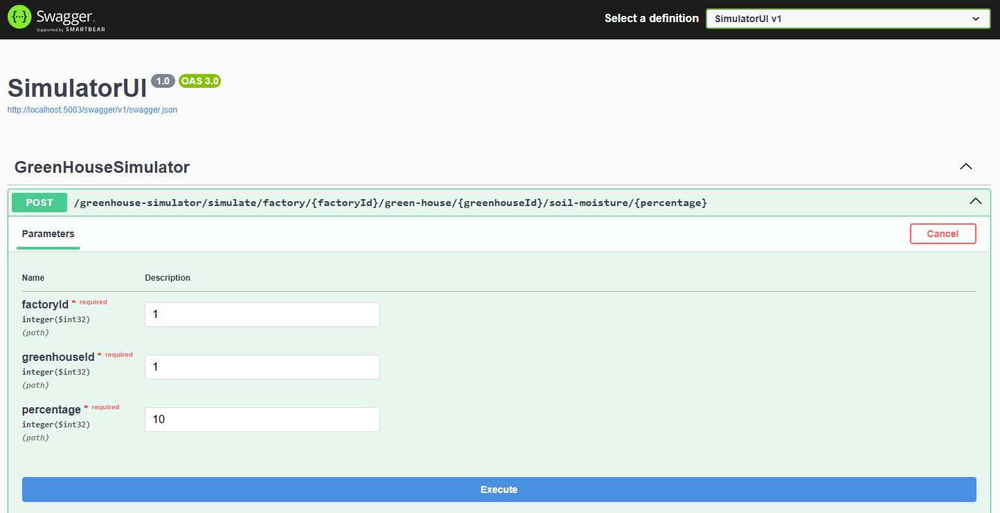
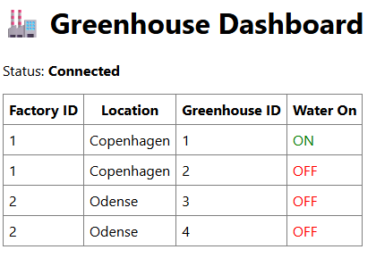

# User guide
## Run solution
- Navigate to the /Src folder.
- Start all microservices using: docker compose up --build.
- Open the Dashboard application at http://localhost:5006/
 to view all factories and greenhouses, their locations, and whether watering is currently active.

- To simulate greenhouse data, open the Simulator application at http://localhost:5003/swagger/index.html.

- When you trigger a simulation event, it will be processed across multiple microservices. These services determine whether watering should be enabled or disabled for each greenhouse based on the soil moisture percentage. The resulting state is saved to the database and reflected in the Dashboard.

## Folder overview
| Folder        | Description                                                                  |
| ------------- | ---------------------------------------------------------------------------- |
| Src           | Contains the source code and docker-compose.yml for running all microservices |
| report        | Contains the project report                                                          |
| Documentation | Contains PlantUML solution documentation                               |
| images        | Contains images for the user guide and plamtuml                                      |

# Repository url:
https://github.com/jhmichelsen/software_architecture_project